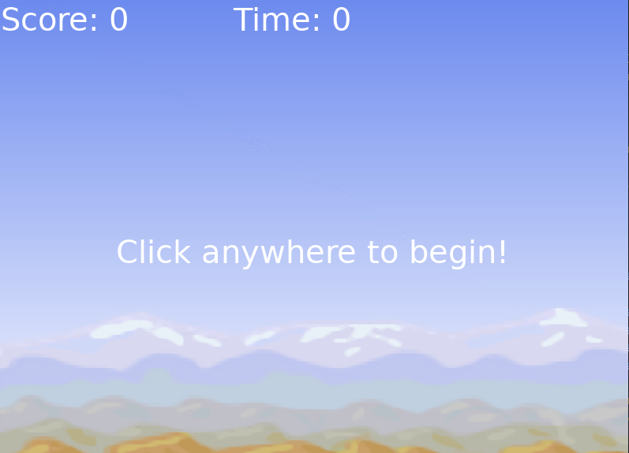

# Lua Games

Welcome to my personal project - a collection of games implemented in Lua. These games are not designed as teaching tools, but are a showcase of what I've learned and created while exploring the Lua programming language. I believe that they are pretty cool and I hope you'll enjoy them as much as I enjoyed creating them.

## Inspiration
The original idea of these games is based on this [Udemy course](https://www.udemy.com/course/lua-love/). While the games have been implemented by me as part of my learning journey, the initial concepts and ideas are inspired by the course.

## Games

### 1. Shooting Gallery

The first game in this collection is a **Shooting Gallery** game. In this game, you have a time limit of **10 seconds** to shoot a target as many times as you can.




#### How to play

Move your crosshair onto the target and click to shoot. The scoring system is as follows:
- A **left click** awards **one point**.
- A **right click** awards **two points**, but removes **one second** from the timer.

Be careful, if you miss the target, a point will be deducted from your score. So, aim carefully and try to score as high as you can within the time limit!

### 2. Zombie Shooter

The second game in this collection is a **Zombie Shooter** game. In this game, you have a time limit of **300 seconds** to try and survive the undead onslaught.


Move your character using the <kbd>W</kbd><kbd>A</kbd><kbd>S</kbd><kbd>D</kbd> or the arrow keys, and **left click** to shoot

Be wary of the beefy zombies though!

## How to play

1. **Install Love2D:**
    - Download and install Love2D from the [official website](https://love2d.org/)
    - Follow the installation instructions based on your operating system.
2. **Download the repository locally**
3. **Run The Game**:
    - Drag the project folder onto the Love2D executable or run the following command in the terminal or command prompt:
    ```bash
    love /path/to/the/game
    ```
    


